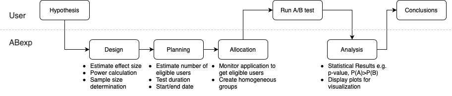

=====
ABexp
=====

.. include:: badges.rst

A/B testing is a methodology based on user experience which consists in comparing two or more variants of a single
variable and determining which one performs better according to predefined criteria. It includes wide applications in
the field of statistics.

Many industries have been using A/B test to optimize business processes and user experience. There are existing tools
and/or public libraries available to address this problem (mainly implemented in ``R``, fewer in ``Python``). However,
they typically hide the statistical techniques running under the hood and they are mostly focused on a very specific
aspect of the end-to-end experiment flow (e.g. a tool for post A/B test analysis which uses frequentist statistical
techniques).

A/B testing is a sensitive and critical aspect within Playtika organization. This pushed us to tackled this problem
drawing attention to today's state-of-the art techniques.

**ABexp**  is a ``Python`` library which aims to support users along the entire end-to-end A/B test
experiment flow (see picture below). It contains A/B testing modules which use both frequentist and bayesian
statistical approaches including bayesian generalized linear model (GLM).

ABexp also provides detailed documentation and tutorials in order to help and guide users in running A/B test
experiments.

.. note::
    ABexp is a generic library that can be directly used by analysts and data scientists as standalone product when
    imported in  ``Jupyter Notebook`` or ``Python`` projects. It can also be used in the background of more complex
    products that expose its functionalities through a user interface.
